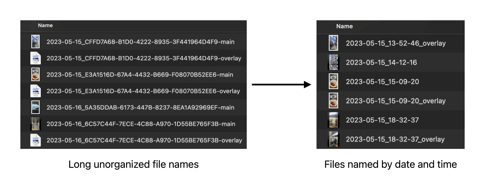
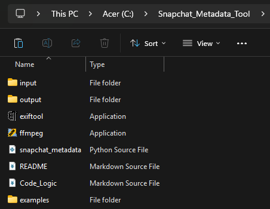
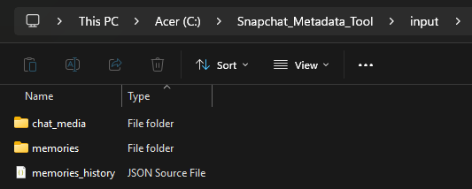
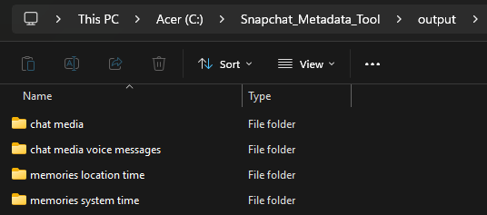
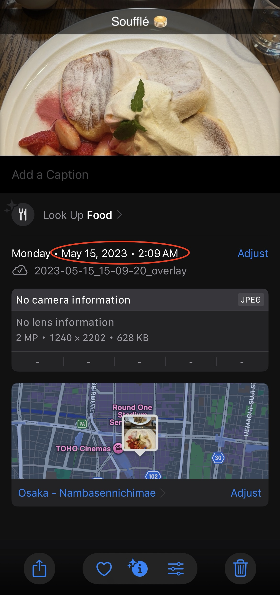
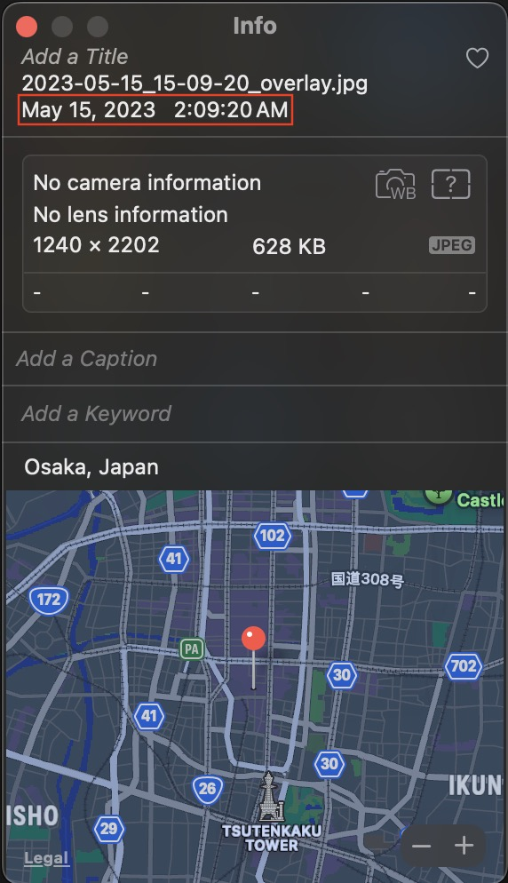

# Snapchat Memories and Chat Media Caption Adder and Metadata Restoration Tool

## 📖 Overview

This tool rebuilds a user's Snapchat Memories and Chat Media, restoring pictures, videos, and voice messages with accurate timestamps, GPS coordinates, and captions where available. It ensures your files appear correctly with all necessary metadata attached to the media files in Windows File Explorer and iCloud Photos, with media properly displayed in map and timeline views.


### 🎬 Watch the full demo on YouTube

[](https://www.youtube.com/watch?v=YOUR_VIDEO_ID)

---

## ✨ Key Features

- Restores date, time, and GPS metadata to Memories
- Adds overlays / captions to Memories
- Merges multi-clip video Memories
- Processes Chat Media and voice messages with date metadata
- Photos and Videos compatible with Apple Photos
- Renames files by date and time

<p style="font-size: 50px;text-align:center;">Memories</p>





<p style="font-size: 50px;text-align:center;">Chat Media</p>


---

## 🧩 Extensive Feature List / How it Works

List of all tool’s features along with a high-level explanation of how each function operates.
(For a deeper look, see the **Code_Logic** file in the repository.)

### 🕒 Embeds Date, Time, and Location Metadata for Memories

- Restores each memory’s metadata by matching its filename’s unique ID to the corresponding record in the `memories_history.json` file.
- Extracts each file’s date, time, and GPS coordinates from `memories_history.json`, converting from UTC to the memory’s local timezone based on its GPS coordinates (with correct DST handling).
- Uses the system timezone when GPS data is unavailable.
- Embeds GPS metadata that is fully compatible with Apple Photos, ensuring photos and videos appear correctly in the **Map** view.
- Creates two output folders ensuring correct display across systems:
  - `memories location time/` — timestamps converted to the GPS location’s timezone.
  - `memories system time/` — timestamps converted to the system’s timezone (recommended for Apple Photos).

### 🖼️ Memories Overlay Support (Captions & Filters)

- Matches image and video `_main` files with their corresponding `_overlay.png`.
- Applies overlays to all media types and orientations (including videos saved from outside apps like TikTok) with proper scaling and positioning.
- Produces both overlayed and non-overlayed versions of each file, ensuring identical date, time, and GPS metadata across both.

### 🎬 Merging Multi-Clip Video Memories

- Detects long-form video memories split into multiple clips by matching `.mp4` files with identical GPS coordinates and timestamps within 10 seconds of each other.
- Merges these clips into a single video, preserving metadata and chronological order.

### 💬 Chat Media Handling

- Extracts the date from each filename and embeds it into file metadata.
- Sets all Chat Media timestamps to **12:00 PM** since no time data is provided by Snapchat.
- Skips video thumbnail images to avoid redundancy.
- Separates saved Chat Media into organized folders:
  - `chat media/` — for images and videos.
  - `chat media voice messages/` — for saved voice notes.

### 🏷️ File Renaming

- **Memories:**
  - Renames files using the format `YYYY-MM-DD_HH-MM-SS` (adds `_overlay` if applicable).
  - If multiple files share the same timestamp, adds incremental numbering (`_1`, `_2`, etc.) to avoid duplicates.
- **Chat Media:**
  - Uses format `YYYY-MM-DD_chat_media_#` for images/videos and `YYYY-MM-DD_voice_message_#` for voice messages.
  - Also adds incremental numbering for duplicates (`_1`, `_2`, etc.).

---

## 📦 Downloading Your Snapchat Data

To use this tool, you’ll need to export your Snapchat data from the official **My Data** page.

1. Go to [Snapchat’s My Data page](https://accounts.snapchat.com/accounts/downloadmydata).
2. Log in.
3. In the export options, make sure the following boxes are checked:
   - ✅ **Memories**
   - ✅ **JSON Files**
   - ✅ **Chat Media**


4. Wait for Snapchat to email you a download link (this may take a long time), then click the link and extract the ZIP file.
5. Inside the ZIP, locate:
   - `memories/` — folder containing photos and videos
   - `chat_media/` — folder containing saved media from chats
   - `memories_history.json` — metadata file with timestamps, GPS, etc.
6. Move those three items into the `input/` folder before running the script.

---

## ⚙️ Installation

### 1. Install Python

This tool is written in Python, so **Python 3 must be installed** before running the script.

#### 🪟 Windows

Windows does _not_ include Python by default.

1. Download Python from the official website:  
   https://www.python.org/downloads/windows/
2. Run the installer.
3. **Important:** Check the box **“Add Python to PATH”** during installation.
4. Finish the install and restart PowerShell.

#### 🍏 macOS

macOS includes an old version of Python by default. Depending on the version it may or not be able to run this script.  
You must have a modern version of Python 3 installed.

1. Download Python for macOS:  
   https://www.python.org/downloads/macos/
2. Open the `.pkg` installer and complete setup.
3. Restart Terminal.

To verify installation:

```
python3 --version
```

If successful, you should see something like:

```
Python 3.x.x
```

> 💡 **Tip:** If both `python` and `python3` work on your system, use whichever one prints a Python 3 version.

### 2. Clone or Download the Repository

If you have Git installed:

```bash
git clone https://github.com/sean-mehra/Snapchat_Memories_Tool.git
cd Snapchat_Memories_Tool
```

> 💡 **Alternatively:**  
> If you’re not using Git, go to the repository webpage and click  
> **Code → Download ZIP**, then extract it.

### 3. Install Required Programs

- #### 🧾 [**Download ExifTool**](https://exiftool.org/) — used to read and write photo and video metadata.

  1. Locate the downloaded file — it will usually be named **`exiftool(-k).exe`** on Windows or **`exiftool`** on Mac.
  2. If you see “(-k)” in the name, rename it to **`exiftool.exe`**.
     > ⚠️ The “-k” flag keeps the window open and can interfere with automated processing.
  3. Move the single `exiftool.exe` (Windows) or `exiftool` (Mac) file into the **same folder** as `snapchat_metadata.py` (the `Snapchat_Memories_Tool/` folder).

- #### 🧩 [**Download FFmpeg**](https://ffmpeg.org/download.html) — used to process and merge videos.

  1. Download the ZIP file for your operating system.
  2. Extract the ZIP file.
  3. Inside the extracted folder, open the **bin** (or **contents**) folder — you’ll find a file named **`ffmpeg.exe`** (Windows) or **`ffmpeg`** (Mac).
  4. Move that file into the **same folder** as `snapchat_metadata.py` (the `Snapchat_Memories_Tool/` folder).

  To verify FFmpeg is working, open **Terminal** or **PowerShell** and type:

  ```bash
  ffmpeg -version
  ```

  If version info appears, you’re ready to go ✅

> 💡 **Note:**  
> On some systems, when ExifTool and FFmpeg are downloaded they may already be available through your terminal. However, to avoid any path or permission issues, this guide recommends placing both executables directly in the same folder as `snapchat_metadata.py` for guaranteed compatibility.

> 💡 **Optional (Advanced Users):**  
> If you prefer, you can install FFmpeg and ExifTool globally using a package manager like **Chocolatey** (Windows) or **Homebrew** (Mac).
>
> Windows (Chocolatey):
>
> ```bash
> choco install ffmpeg exiftool
> ```
>
> Mac (Homebrew):
>
> ```bash
> brew install ffmpeg exiftool
> ```
>
> ⚠️ **Important:** Don’t mix installs. Use **either** a global install **or** local executables in this folder — **not both**.  
> If you use Chocolatey/Homebrew (global), **do not place `ffmpeg.exe` or `exiftool.exe` in the project folder**, or the script may fail to detect the correct one.

### 4. Install Required Python Packages

Open your terminal or PowerShell and run this command **once**:

```bash
pip install pytz tzlocal timezonefinder Pillow
```

If successful, you’ll see a message similar to:

```bash
Successfully installed pytz tzlocal timezonefinder Pillow
```

---

## 🔒 System Security Reminders

### Windows 🪟

Windows may block outside downloads the first time you run them.

If you see a popup saying:

> "Windows protected your PC"

This is normal — Windows is warning you because the tools were downloaded from the internet.

**To allow them:**

1. Click **More info**
2. Click **Run anyway**

Once approved the first time, they will run normally.

> 💡 **Tip:**
> If Windows deletes the file immediately after download, check **Windows Security → Virus & threat protection → Protection history** and restore it.

### macOS 🍏

macOS may block outside applications when you first download them.

If you see a message such as:

> "application cannot be opened because it is from an unidentified developer."

or the script appears to do nothing — macOS likely blocked the tool.

**To allow them:**

1. Open **System Settings**
2. Go to **Privacy & Security**
3. Scroll down to the **Security** section
4. Click **Allow Anyway** next to the application
5. Run the script again

> 💡 **Tip:**  
> Sometimes macOS hides the popup behind other windows.  
> If you don’t see a warning, still check **System Settings → Privacy & Security**.

---

## 🗂️ Folder Setup

**Place your exported Snapchat data into the input folder.**

- Make sure you’ve already exported your data following the [📦 Downloading Your Snapchat Data](#-downloading-your-snapchat-data) instructions.
- Include these three items inside the `input/` folder:
  - `memories/` — folder containing exported Memories (photos/videos)
  - `chat_media/` — folder containing saved media from chats (photos/videos/voice messages)
  - `memories_history.json` — metadata file with date, time, and GPS data

> 💡 **Tip:**  
> If your downloaded `memories` and `chat_media` folders from Snapchat's 'My Data' export contains a large number of files, consider selecting only the specific photos or videos you want to process.  
> _Processing a large amount of files can take a long time depending on your system’s speed and the number of memories._

**Your project folder should look like this:**





```
Snapchat_Memories_Tool/
│
├── input/
│   ├── chat_media/                (downloaded from Snapchat My Data)
│   ├── memories/                  (downloaded from Snapchat My Data)
│   └── memories_history.json      (downloaded from Snapchat My Data)
│
├── output/
│   ├── chat media/                (processed chat photos & videos)
│   ├── chat media voice messages/ (processed voice messages)
│   ├── memories location time/    (Memories using GPS-local timezone)
│   └── memories system time/      (Memories using system-local timezone)
│
├── exiftool.exe                   (ExifTool executable for metadata)
├── ffmpeg.exe                     (FFmpeg executable for video processing)
├── snapchat_metadata.py           (main Python script)
├── README.md                      (directions)
├── Code_Logic.md                  (explanation of how each function works)
└── examples/                      (demonstration images for README.md)
```

> The `input` folder should contain your `memories`, `chat_media`, and `memories_history.json` files exactly as downloaded from the Snapchat “My Data” portal.

> ⚙️ **Note:**  
> Most users should place both `ffmpeg.exe` and `exiftool.exe` in the main project folder (as shown above).  
> However, if you’ve installed them globally using **Chocolatey** (Windows) or **Homebrew** (Mac),  
> **do not also place copies in the folder** — the script will automatically detect your global installation.

---

## ▶️ How to Run Script

1. **Type this in your terminal or PowerShell to open the project folder:**

   ```bash
   cd path/to/Snapchat_Memories_Tool
   ```

2. **Type this to run the script:**

   ```bash
   python snapchat_metadata.py
   ```

3. **Wait for processing to finish.**

- `output/chat media/` → Photos and videos from saved chats with corrected timestamps
- `output/chat media voice messages/` → Voice messages from saved chats with corrected timestamps
- `output/memories location time/` → Memories timestamps converted to GPS timezone
- `output/memories system time/` → Memories timestamps converted to your system’s timezone

4. **View or upload your results.**
   - Files in `memories location time` sort correctly by title when viewed in File Explorer (recommended for Windows).
   - Files in `memories system time` display accurate timestamps and map locations when uploaded to iCloud Photos (recommended for Apple Photos).
   - Files in `chat media` and `chat media voice messages` will appear with accurate creation dates and fully restored metadata.

> 💡 **Note:**  
> The filenames in both `memories location time/` and `memories system time/` folders use the **GPS-local time** for consistency and accurate chronological sorting by name, so only the timestamp internal metadata differs between both folders.  
> While script is running you might briefly see temporary files appear in your project folder (for example, names like `temp_concat_12345.mp4` or `exiftool_tmp`). These are **automatically created** by FFmpeg or ExifTool, while re-encoding videos and writing metadata. They are automatically **deleted once processing finishes**, so you don’t need to remove them manually.

---

## 📤 Importing to Apple Photos (Mac or iCloud for Windows)

After processing completes, use the files from the `output/memories_system_time/` folder when importing to Apple Photos to ensure timestamps and GPS data display correctly across all Apple devices.

### 🍏 Mac Users

1. Open the **Photos** app.
2. Select the processed files you want from the `output/memories_system_time/` folder and copy or drag them to the photos app.
3. These photos and vidoes will have the correct **date** and **map locations** automatically and can be sorted by Date Captured. They will also show up as a part of the **Import** section of photos.

### 🪟 Windows Users (via iCloud for Windows)

1. Open the **iCloud Photos** folder in File Explorer.
2. Copy or drag the processed files from `output/memories_system_time/` into the **iCloud Photos** folder in file explorer.
3. Wait for them to sync — they’ll appear in your iPhone’s Photos app with correct timestamps and GPS data and can be sorted by Date Captured.

> **🕓 Note on time display:**  
> Apple Photos on iPhone automatically adjusts timestamps using GPS location data, while the macOS Photos app typically displays the embedded timestamp as-is.  
> This means photos may appear unchanged in time on Mac but will display the correct localized time when viewed on iPhone.

#### iPhone Photo:

<p>
  
  
</p>

#### Mac Photo:

<p>
  
  
</p>

> **💡 Important Notes:**  
> If uploaded files fail to appear, try **renaming** them or **clearing cached versions** in iCloud Photos.  
> If a video’s preview image doesn’t appear right away, just wait — Photos will generate it shortly.  
> For iCloud Photos Always upload from `output/memories_system_time/` — Apple Photos automatically adjusts for GPS timezones.  
> _Using `memories_location_time/` can cause timestamps to appear double-adjusted._  
> Run the script and upload your files while your device is in the **same timezone**.  
> _Uploading from a different timezone than where the script was run can shift timestamps by several hours._

---

## 🧹 Files Not Required to Run the Script

- `.git` — Git version tracking folder
- `.gitignore` — excludes unnecessary files from commits
- `.DS_Store` — macOS system file
- `.gitkeep` — placeholder to preserve empty directories on GitHub
- `README` — directions on how to run script
- `examples/` — demonstration images for the `README.md` file
- `Code_Logic` — documentation for users interested in detailed function breakdowns

---

## 🪪 License

This project is currently unlicensed. All rights reserved by the author.

---

## 🙌 Acknowledgments

I understand that this tool may not be easy to use for non-developers, which is why I’ve included detailed explanations throughout this README and created a full video tutorial to guide users step-by-step.

If you still encounter issues, you can upload this `README.md` and the `snapchat_metadata.py` file into a generative AI tool such as **ChatGPT** or **Gemini** and ask for assistance. It can assist you throughout the setup and even help you troubleshoot.

This project was built through extensive testing and iteration using **Python**, **ExifTool**, and **FFmpeg**. It was inspired by the need to restore accurate metadata and organization to Snapchat Memories and Chat Media after exporting a user’s data from the Snapchat website.

While other developers have built similar tools in the past, they do not handle timezone-based adjustments for memories, compile video memories, or process `chat_media` files. Additionally, many existing programs rely on active download links from the `memories_history.json` file. This tool instead works directly with the locally downloaded files — meaning it continues to function even if those links expire or are no longer live.
