# Snapchat Memories and Chat Media Caption Adder and Metadata Restoration Tool

<h2 id="overview">📖 Overview</h2>

This tool rebuilds a user's Snapchat Memories and Chat Media, restoring pictures, videos, and voice messages with accurate timestamps, GPS coordinates, and captions where available. It ensures your files appear correctly with all necessary metadata attached to the media files in Windows File Explorer and iCloud Photos, with media properly displayed in map and timeline views.


<h3 id="youtube-demo">🎬 YouTube Video Demonstration</h3>

[](https://www.youtube.com/watch?v=drLF8wYNDUA)

---

<h2 id="key-features">✨ Key Features</h2>

- Restores date, time, and GPS metadata to Memories
- Automatically embeds EXIF/XMP `Snapchat` tags for Immich, Google Photos, and Lightroom
- Adds overlays / captions to Memories
- Merges multi-clip video Memories
- Processes Chat Media and voice messages with exact timestamps and sender details
- Photos and Videos compatible with Apple Photos, Immich, and Windows File Explorer
- Renames files by date and time

---

## 📌 Table of Contents

- [📖 Overview](#overview)
- [🎬 YouTube Video Demonstration](#youtube-demo)
- [✨ Key Features](#key-features)
- [📸 Memories](#memories)
- [📩 Chat Media](#chat-media)
- [🧩 Extensive Feature List / How it Works](#how-it-works)
- [⬇️ Clone or Download the Repository](#clone-download)
- [📦 Downloading Your Snapchat Data and Moving its Folders](#download-snapchat-data)
  - [Step 1 - Request your Snapchat data](#step-1---request-your-snapchat-data)
  - [Step 2 - Download your Memories](#step-2---download-your-memories-new-export-format)
  - [Step 3 - Extract all memory ZIP files into one folder](#step-3---extract-all-memory-zip-files-into-one-folder)
    - [🪟 Windows](#download-windows)
    - [🍏 macOS](#download-macos)
  - [Step 4 - Move Chat Media](#step-4---move-chat-media)
  - [Step 5 - Locate the JSON metadata file](#step-5---locate-the-json-metadata-file)
  - [Final input folder structure](#final-input-folder-structure)
- [⚙️ Installation](#installation)
  - [1. Install Python](#1-install-python)
    - [🪟 Windows](#install-python-windows)
    - [🍏 macOS](#install-python-macos)
  - [2. Install Required Programs](#2-install-required-programs)
    - [🧾 Download ExifTool](#download-exiftool)
    - [🧩 Download FFmpeg & FFprobe](#download-ffmpeg)
  - [3. Install Required Python Packages](#3-install-required-python-packages)
- [🗂️ Final Folder Setup](#final-folder-setup)
- [▶️ How to Run Script](#run-script)
- [📤 Importing to Apple Photos](#import-apple-photos)
  - [🪟 Windows](#import-windows)
  - [🍏 MacOS](#import-macos)
- [🔒 System Security Reminders](#system-security)
  - [🪟 Windows](#security-windows)
  - [🍏 macOS](#security-macos)
- [🧹 Files Not Required to Run the Script](#files-not-required)
- [🪪 License](#license)
- [🙌 Acknowledgments & Background](#acknowledgments)

<h2 align="center" id="memories">Memories</h2>


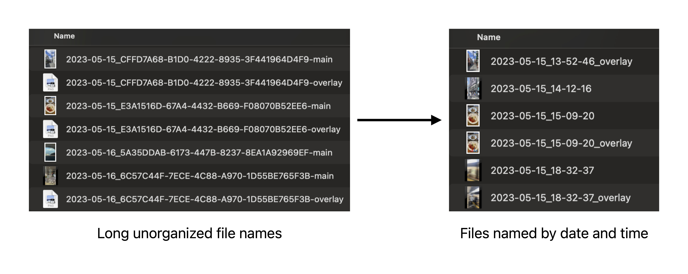


<h2 align="center" id="chat-media">Chat Media</h2>


---

<h2 id="how-it-works">🧩 Extensive Feature List / How it Works</h2>

List of all tool’s features along with a high-level explanation of how each function operates.
(For a deeper look, see the **Code_Logic** file in the repository.)

### 🕒 Embeds Date, Time, and Location Metadata for Memories

- Restores each memory’s metadata by matching its filename’s unique ID to the corresponding record in the `memories_history.json` file.
- Extracts each file’s date, time, and GPS coordinates from `memories_history.json`, converting from UTC to the memory’s local timezone based on its GPS coordinates (with correct DST handling).
- Uses the system timezone when GPS data is unavailable.
- Embeds GPS metadata that is fully compatible with Apple Photos, ensuring photos and videos appear correctly in the **Map** view.
- Creates two output folders ensuring correct display across systems:
  - `memories location time/` — timestamps converted to the GPS location’s timezone.
  - `memories system time/` — timestamps converted to the system’s timezone (recommended for Apple Photos).

### 🖼️ Memories Overlay Support (Captions & Filters)

- Matches image and video `_main` files with their corresponding `_overlay.png`.
- Applies overlays to all media types and orientations (including videos saved from outside apps like TikTok) with proper scaling and positioning.
- Produces both overlayed and non-overlayed versions of each file, ensuring identical date, time, and GPS metadata across both.

### 🎬 Merging Multi-Clip Video Memories

- Detects long-form video memories split into multiple clips by matching `.mp4` files with identical GPS coordinates and timestamps within 10 seconds of each other.
- Merges these clips into a single video, preserving metadata and chronological order.

### 💬 Chat Media Handling

- Matches Chat Media filenames to `chat_history.json` (if provided) to extract exact original UTC timestamps, sender usernames (`From`), and conversation titles (`Conversation Title`).
- Automatically converts UTC timestamps into your local system timezone.
- Falls back to file creation timestamps or `00:00:00` if `chat_history.json` is not provided.
- Skips video thumbnail images to avoid redundancy.
- Separates saved Chat Media into organized folders:
  - `chat media/` — for images and videos.
  - `chat media voice messages/` — for saved voice notes.

### 🏷️ Automatic EXIF Tagging (Immich / Google Photos / Lightroom)

- Automatically embeds standard EXIF and XMP keyword tags (`-Keywords=Snapchat`, `-XPKeywords=Snapchat`, `-XMP-dc:Subject=Snapchat`) into all output files.
- Allows photo management platforms like **Immich**, Google Photos, and Adobe Lightroom to automatically assign the **`Snapchat`** tag to your imported media upon upload.

### 🏷️ File Renaming

- **Memories:**
  - Renames files using the format `YYYY-MM-DD_HH-MM-SS` (adds `_overlay` if applicable).
  - If multiple files share the same timestamp, adds incremental numbering (`_1`, `_2`, etc.) to avoid duplicates.
- **Chat Media:**
  - Uses format `YYYY-MM-DD_chat_media_#` for images/videos and `YYYY-MM-DD_voice_message_#` for voice messages.
  - Also adds incremental numbering for duplicates (`_1`, `_2`, etc.).

---

<h2 id="clone-download">⬇️ Clone or Download the Repository</h2>

If you have Git installed:

```bash
git clone https://github.com/sean-mehra/Snapchat_Memories_Tool.git
cd Snapchat_Memories_Tool
```

> 💡 **Alternatively:**  
> If you’re not using Git, go to the repository webpage and click  
> **Code → Download ZIP**, then extract it.

The downloaded folder may have a `-main` written at the end of the filename. You can remove it making sure the folder name is `Snapchat_Memories_Tool` to remain consistent with the rest of the directions here.

---

<h2 id="download-snapchat-data">📦 Downloading Your Snapchat Data and Moving its Folders</h2>

> ⚠️ **Export format notice** ⚠️  
> Snapchat has changed how _My Data_ exports work.  
> Older exports came with all Memories already bundled inside a `memories/` folder.  
> New exports instead provide a `memories_history.html` file which links to where users have to **download individual ZIP files for each memory**.
>
> This tool was originally designed for the older format but **fully supports the current export system** — it just requires one extra step of manually consolidating the memories files.

To use this tool, you must first export your data from Snapchat.

### Step 1 - Request your Snapchat data

1. Go to [Snapchat’s My Data page](https://accounts.snapchat.com/accounts/downloadmydata).

2. Log in with your Snapchat account.

3. Make sure the following boxes are selected:
   - ✅ **Memories**
   - ✅ **JSON Files**
   - ✅ **Chat Media**

<p>
  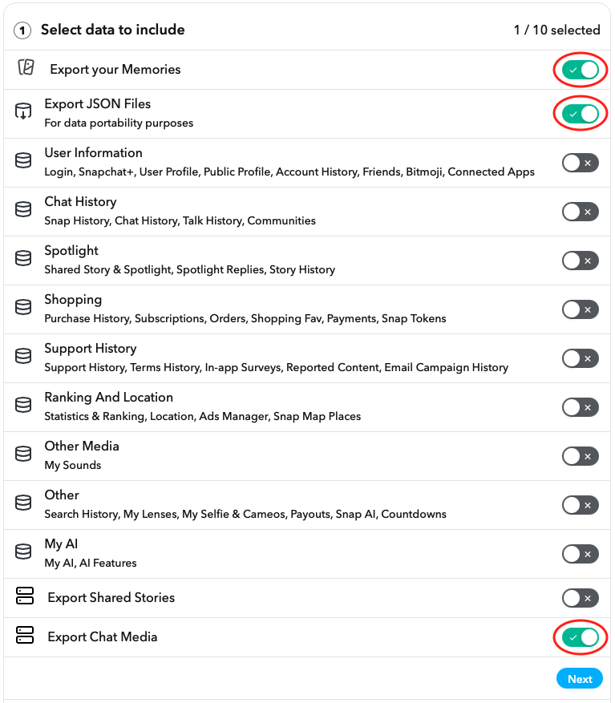
</p>

4. Select **All Time** for the date range and enter an email where Snapchat can send your export link.

<p>
  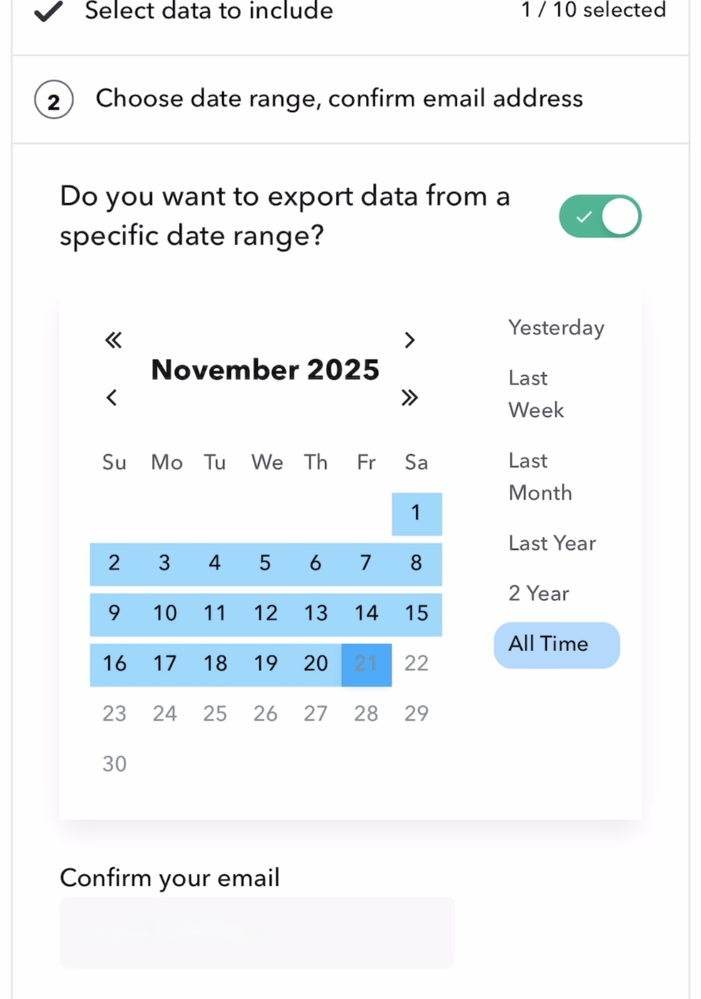
</p>

5. Wait for Snapchat to email you a download link (this may take a while).

<p>
  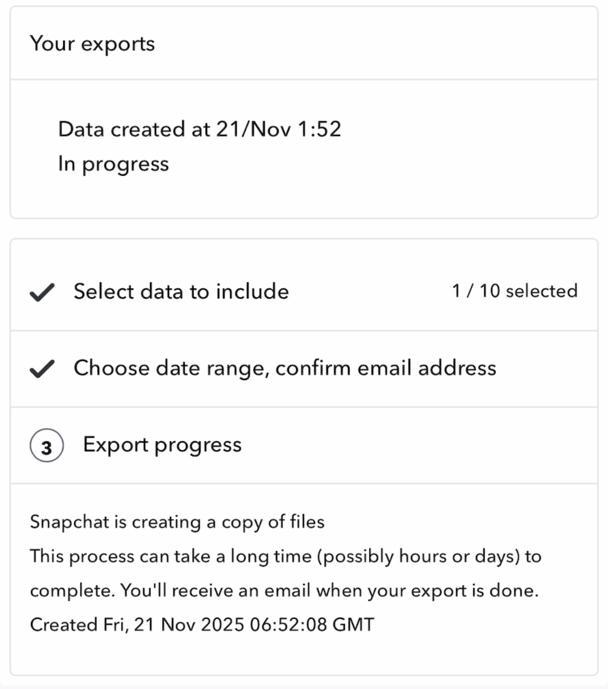
</p>

<p>
  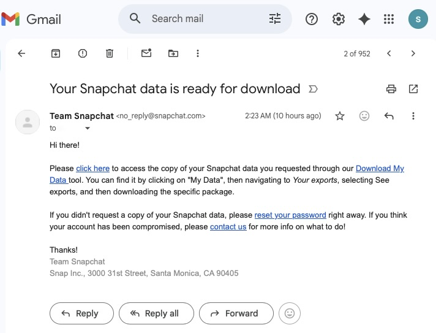
</p>

6. Download and extract the main ZIP file.

<p>
  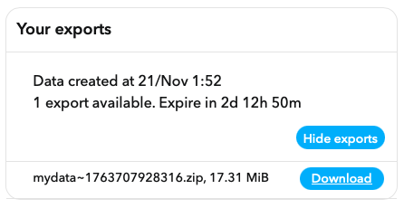
</p>

> ⚠️ **Important:**
>
> **If you have a past version of Snapchat's "My Data" export where all the memories came in their own dedicated `memories/` folder:**
>
> Put the content of that memories folder into `Snapchat_Memories_Tool/input/memories/` and you can skip steps 2 and 3 in this section and go straight to [Step 4 - Move Chat Media](#step-4---move-chat-media)
>
> **However, if you are exporting your data now:**
>
> Snapchat requires users to download all their memories in individual zipped files through their website.
>
> **Steps provided for the setup below.**

### Step 2 - Download your Memories (new export format)

After extracting the ZIP, find and open `memories_history.html` in the `mydata~X/html/`

<p>
  
</p>

<p>
  
</p>

This will open a webpage with your Snapchat Memories all listed avaliable to download.

<p>
  
</p>

Wait for all the downloads to complete. Each memory will download as its own ZIP file.

<p>
  
</p>

<p>
  
</p>

<p>
  
</p>

### Step 3 - Extract all memory ZIP files into one folder

Now extract **all downloaded memory ZIP files** and put the contents into `Snapchat_Memories_Tool/input/memories/`.

> If you do not need help doing this go straight to [Step 4 - Move Chat Media](#step-4---move-chat-media)

This can be done manually. However, manually opening each unzipped folder then copying and pasting its contents into a seperate folder can be time consuming depending on how many folders Snapchat generates, so listed below are steps to help guide users on how to do this in a streamlined fashion:

First create a seperate folder that will temporarily be dedicated to put all the extracted unzipped folders into one place.  
(For this example I named the folder `memories temp`)

<h4 id="download-windows">🪟 Windows</h4>

> Windows does not natively allow users to extract multiple zipped files at once.  
> In order to accomplish this a zip tool needs to be used — for this example I am using [7-Zip](https://www.7-zip.org/).

Open the 7zFM Application and open the folder with all the zipped files (here it is the downloads folder)

<p>
  
</p>

Go to `view` and select `Type` so all the zipped files are next to each other

<p>
  
</p>

Highlight all the zipped files and press `Extract`

<p>
  
</p>

Enter the path for the `memories temp` folder

<p>
  
</p>

The program will extract them into multiple unzipped folders.

For the next steps continue [here](#now-open-the-memories-temp-folder).

<h4 id="download-macos">🍏 macOS</h4>

Sort by `Kind` by clicking the column heading so all the zipped files are next to each other (if one of those headings is not there right click the heading row and select it from the options)

<p>
  
</p>

Look for the Zipped files and highlight them.
Right-click and select **Open With > Archive Utility**.

<p>
  
</p>

Your system will extract them into multiple unzipped folders.

Next move the extracted folders to the `memories temp` folder

<p>
  
</p>

#### Now open the `memories temp` folder

Click the search bar in the top-right corner. Then type "`.`" into the search.

<p>
  
</p>

This will display **every file inside every subfolder**.

Select all the photo and video files then drag or copy and paste them into `Snapchat_Memories_Tool/input/memories/`

### Step 4 - Move Chat Media

Now move the Contents of the chat_media folder into `Snapchat_Memories_Tool/input/chat_media/`:

👉 Final goal:

- All memory media → `input/memories/`
- All chat media → `input/chat_media/`

### Step 5 - Locate the JSON metadata files

In your exported Snapchat data, locate the following files in the `json/` folder:
- `memories_history.json` (required for Memories)
- `chat_history.json` (recommended for exact Chat Media timestamps, senders, and chat titles)

Copy these files into your `input/` folder.

### Final input folder structure

Once everything is ready, your folder should look like this:

```text
Snapchat_Memories_Tool/
  input/
    memories/
    chat_media/
    memories_history.json
    chat_history.json
```

---

<h2 id="installation">⚙️ Installation</h2>

### 1. Install Python

This tool is written in Python, so **Python 3 must be installed** before running the script.

<h4 id="install-python-windows">🪟 Windows</h4>

Windows does _not_ include Python by default.

1. Download Python from the official website:  
   https://www.python.org/downloads/windows/
2. Run the installer.
3. **Important:** Check the box **“Add Python to PATH”** during installation.
4. Finish the install and restart PowerShell.

<h4 id="install-python-macos">🍏 macOS</h4>

macOS includes an old version of Python by default. Depending on the version it may or not be able to run this script.  
You must have a modern version of Python 3 installed.

1. Download Python for macOS:  
   https://www.python.org/downloads/macos/
2. Open the `.pkg` installer and complete setup.
3. Restart Terminal.

To verify installation:

```
python3 --version
```

If successful, you should see something like:

```
Python 3.x.x
```

> 💡 **Tip:** If both `python` and `python3` work on your system, use whichever one prints a Python 3 version.

### 2. Install Required Programs

- <h4 id="download-exiftool"> 🧾 <a href="https://exiftool.org/" target="_blank"><strong>Download ExifTool</strong></a> — used to read and write photo and video metadata. </h4>

  1. Locate the downloaded file — it will usually be named **`exiftool(-k).exe`** on Windows or **`exiftool`** on Mac.
  2. If you see “(-k)” in the name, rename it to **`exiftool.exe`**.
     > ⚠️ The “-k” flag keeps the window open and can interfere with automated processing.
  3. Move `exiftool.exe` and its accompanying **`exiftool_files/`** folder (Windows) into the **same folder** as `snapchat_metadata.py` (the `Snapchat_Memories_Tool/` folder).
     > ⚠️ On Windows, `exiftool.exe` requires the `exiftool_files/` folder in the same directory to execute without missing DLL errors.
     > ⚠️ For Mac standard package should already place it in `/usr/local/bin` for easy Terminal access

- <h4 id="download-ffmpeg"> 🧩 <a href="https://ffmpeg.org/download.html" target="_blank"><strong>Download FFmpeg & FFprobe</strong></a> — used to process and merge videos. </h4>

  1. Download the ZIP file for your operating system.
  2. Extract the ZIP file.
  3. Inside the extracted folder, open the **bin** (or **contents**) folder — you’ll find a file named **`ffmpeg.exe`** (Windows) or **`ffmpeg`** (Mac).
  4. For windows move that files into the **same folder** as `snapchat_metadata.py` (the `Snapchat_Memories_Tool/` folder).
     > ⚠️ For Mac move files into /usr/local/bin

  To verify they are working, open **Terminal** or **PowerShell** and type:

  ```bash
  ffmpeg -version
  ffprobe -version
  ```

  If version info appears, you’re ready to go ✅

> 💡 **Note:**  
> On some systems, when ExifTool and FFmpeg are downloaded they may already be available through your terminal. However, to avoid any path or permission issues, this guide recommends placing both executables directly in the same folder as `snapchat_metadata.py` for guaranteed compatibility.

> 💡 **Optional (Advanced Users):**  
> If you prefer, you can install FFmpeg and ExifTool globally using a package manager like **Chocolatey** (Windows) or **Homebrew** (Mac).
>
> Windows (Chocolatey):
>
> ```bash
> choco install ffmpeg exiftool
> ```
>
> Mac (Homebrew):
>
> ```bash
> brew install ffmpeg exiftool
> ```
>
> ⚠️ **Important:**  
> Don’t mix installs. Use **either** a global install **or** local executables in this folder — **not both**.  
> If you use Chocolatey/Homebrew (global), **do not place `exiftool.exe`, `ffmpeg.exe`, or `ffprobe.exe` in the project folder**, or the script may fail to detect the correct one.

### 3. Install Required Python Packages

Open your terminal or PowerShell and run this command **once**:

```bash
pip install pytz tzlocal timezonefinder Pillow
```

If successful, you’ll see a message similar to:

```bash
Successfully installed pytz tzlocal timezonefinder Pillow
```

---

<h2 id="final-folder-setup">🗂️ Final Folder Setup</h2>

**Place your exported Snapchat data into the input folder.**

- Make sure you’ve already exported your data and moved files following the [📦 Downloading Your Snapchat Data and Moving its Folders](#📦-downloading-your-snapchat-data-and-moving-its-folders) instructions.
- Include these three items inside the `input/` folder:
  - `memories/` — folder containing exported Memories (photos/videos)
  - `chat_media/` — folder containing saved media from chats (photos/videos/voice messages)
  - `memories_history.json` — metadata file with date, time, and GPS data

> 💡 **Tip:**  
> If your downloaded `memories` and `chat_media` folders from Snapchat's 'My Data' export contains a large number of files, consider selecting only the specific photos or videos you want to process.  
> _Processing a large amount of files can take a long time depending on your system’s speed and the number of memories._

**Your project folder should look like this:**

```
Snapchat_Memories_Tool/
│
├── input/
│   ├── chat_media/                (downloaded from Snapchat My Data)
│   ├── memories/                  (downloaded from Snapchat My Data)
│   └── memories_history.json      (downloaded from Snapchat My Data)
│
├── output/
│   ├── chat media/                (processed chat photos & videos)
│   ├── chat media voice messages/ (processed voice messages)
│   ├── memories location time/    (Memories using GPS-local timezone)
│   └── memories system time/      (Memories using system-local timezone)
│
├── exiftool.exe   (for Windows)   (ExifTool executable for metadata)
├── exiftool_files/ (for Windows)  (ExifTool supporting DLLs and Perl modules)
├── ffmpeg.exe     (for Windows)   (FFmpeg executable for video processing)
├── ffprobe.exe    (for Windows)   (FFprobe executable for video processing)
├── snapchat_metadata.py           (main Python script)
├── README.md                      (directions)
├── LICENSE.txt                    (project license)
├── Code_Logic.md                  (explanation of how each function works)
└── examples/                      (demonstration images for README.md)
```

(Image examples are for windows)  
(Make sure to include ffprobe as well)  
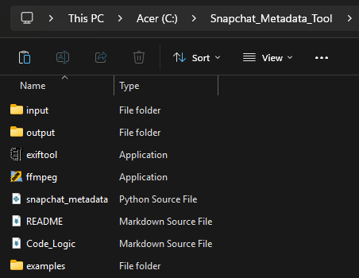
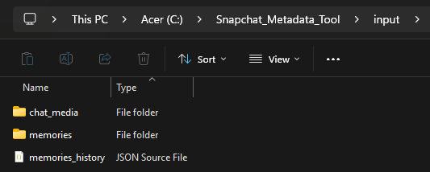
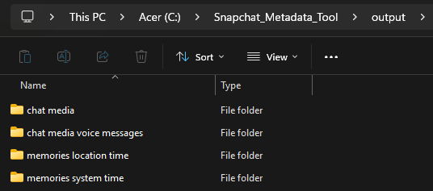

> The `input` folder should contain your `memories`, `chat_media`, and `memories_history.json` files as downloaded from the Snapchat “My Data” portal.

> ⚙️ **Note:**  
> Most users should place both `ffmpeg.exe` and `exiftool.exe` in the main project folder (as shown above).  
> However, if you’ve installed them globally using **Chocolatey** (Windows), **Homebrew** (Mac), or the package already gets placed in `/usr/local/bin` (Mac)  
> **do not also place copies in the folder** — the script will automatically detect your global installation.

---

<h2 id="run-script">▶️ How to Run Script</h2>

1. **Type this in your terminal or PowerShell to open the project folder:**

   ```bash
   cd path/to/Snapchat_Memories_Tool
   ```

2. **Type this to run the script:**

   ```bash
   python snapchat_metadata.py
   ```

3. **Wait for processing to finish.**

- `output/chat media/` → Photos and videos from saved chats with corrected timestamps
- `output/chat media voice messages/` → Voice messages from saved chats with corrected timestamps
- `output/memories location time/` → Memories timestamps converted to GPS timezone
- `output/memories system time/` → Memories timestamps converted to your system’s timezone

4. **View or upload your results.**
   - Files in `memories location time` sort correctly by title when viewed in File Explorer (recommended for Windows).
   - Files in `memories system time` display accurate timestamps and map locations when uploaded to iCloud Photos (recommended for Apple Photos).
   - Files in `chat media` and `chat media voice messages` will appear with accurate creation dates and fully restored metadata.

> 💡 **Note:**  
> The filenames in both `memories location time/` and `memories system time/` folders use the **GPS-local time** for consistency and accurate chronological sorting by name, so only the timestamp internal metadata differs between both folders.  
> While script is running you might briefly see temporary files appear in your project folder (for example, names like `temp_concat_12345.mp4` or `exiftool_tmp`). These are **automatically created** by FFmpeg or ExifTool, while re-encoding videos and writing metadata. They are automatically **deleted once processing finishes**, so you don’t need to remove them manually.

---

<h2 id="import-apple-photos">📤 Importing to Apple Photos</h2>

After processing completes, when importing to Apple Photos follow next steps to ensure timestamps and GPS data display correctly across all Apple devices.

<h3 id="import-windows"> 🪟 Windows (via iCloud for Windows)</h3>

1. Open the **iCloud Photos** folder in File Explorer.
2. Copy or drag the processed files from **`output/memories system time/`** into the **iCloud Photos** folder in file explorer.
3. Wait for them to sync — they’ll appear in your iPhone’s Photos app with correct timestamps and GPS data and can be sorted by Date Captured.

<h3 id="import-macos"> 🍏 macOS</h3>

1. Open the **Photos** app.
2. Select the processed files you want from the **`output/memories location time/`** folder and copy or drag them to the **Photos App**.
3. These photos and vidoes will have the correct **date** and **map locations** automatically and can be sorted by Date Captured. They will also show up as a part of the **Import** section of photos.

> **🕓 Note on time display:**  
> Apple Photos on iPhone automatically adjusts timestamps using GPS location data, while the macOS Photos app typically displays the embedded timestamp as-is.  
> This means photos may appear unchanged in time on Mac but will display the correct localized time when viewed on iPhone.

#### iPhone Photo:

<p>
  
  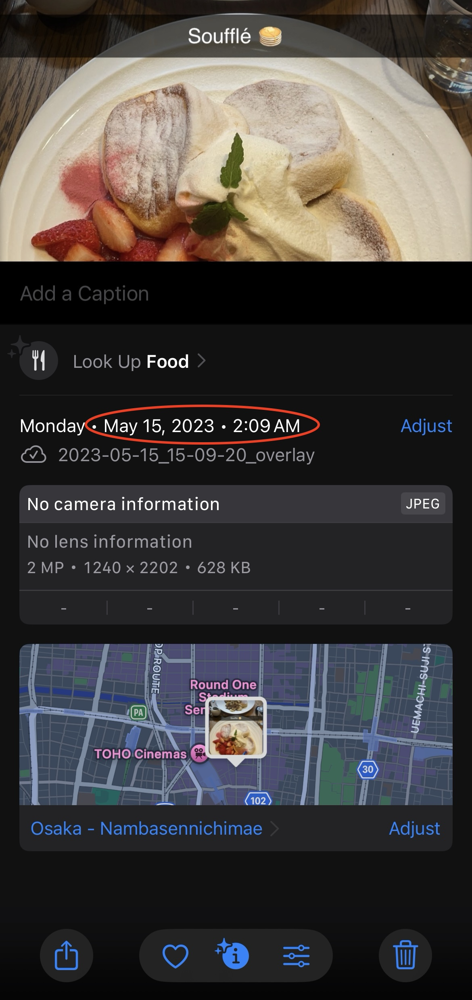
</p>

#### Mac Photo:

<p>
  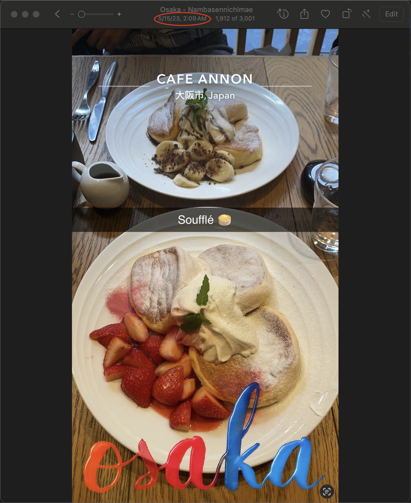
  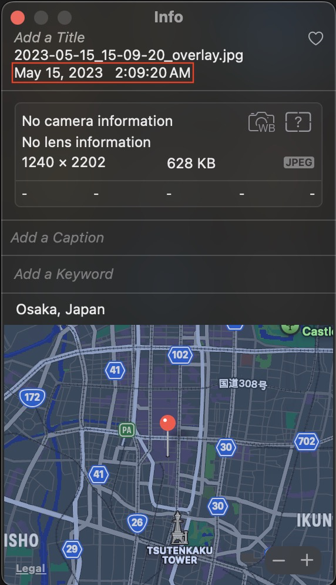
</p>

> **💡 Important Notes:**  
> If uploaded files fail to appear, try **renaming** them or **clearing cached versions** in iCloud Photos.  
> If a video’s preview image doesn’t appear right away, just wait — Photos will generate it shortly.  
> On Windows when using iCloud for Windows always upload from `output/memories system time/` — Apple Photos automatically adjusts for GPS timezones.  
> On Mac when importing to Photos App always use `output/memories location time/`  
> _Using the wrong one can cause timestamps to appear double-adjusted._  
> Run the script and upload your files while your device is in the **same timezone**.  
> _Uploading from a different timezone than where the script was run can shift timestamps by several hours._
>
> For users utilizing the **latest version of "My Data"** Exports there may be some photo and/or video files that were not put in any zipped folders when downloaded. They appear to mostly be photos and videos saved to Snapchat Memories from the camera roll.  
> These can be uploaded to iCloud Photos as well but their times will be in UTC time and they will not have any geolocation metadata

---

<h2 id="system-security">🔒 System Security Reminders</h2>

<h3 id="security-windows"> 🪟 Windows</h3>

Windows may block outside downloads the first time you run them.

If you see a popup saying:

> "Windows protected your PC"

This is normal — Windows is warning you because the tools were downloaded from the internet.

**To allow them:**

1. Click **More info**
2. Click **Run anyway**

Once approved the first time, they will run normally.

> 💡 **Tip:**
> If Windows deletes the file immediately after download, check **Windows Security → Virus & threat protection → Protection history** and restore it.

<h3 id="security-macos"> 🍏 macOS</h3>

macOS may block outside applications when you first download them.

If you see a message such as:

> "application cannot be opened because it is from an unidentified developer."

or the script appears to do nothing — macOS likely blocked the tool.

**To allow them:**

1. Open **System Settings**
2. Go to **Privacy & Security**
3. Scroll down to the **Security** section
4. Click **Allow Anyway** next to the application
5. Run the script again

> 💡 **Tip:**  
> Sometimes macOS hides the popup behind other windows.  
> If you don’t see a warning, still check **System Settings → Privacy & Security**.

---

<h2 id="files-not-required">🧹 Files Not Required to Run the Script</h2>

- `.git` — Git version tracking folder
- `.gitignore` — excludes unnecessary files from commits
- `.DS_Store` — macOS system file
- `.gitkeep` — placeholder to preserve empty directories on GitHub
- `README` — directions on how to run script
- `examples/` — demonstration images for the `README.md` file
- `Code_Logic` — documentation for users interested in detailed function breakdowns
- `LICENSE` — legal terms for using and sharing this project

---

<h2 id="license">🪪 License</h2>

This project is licensed under a custom non-commercial license.  
See the `LICENSE` file for full details.

---

<h2 id="acknowledgments">🙌 Acknowledgments & Background</h2>

I understand that this tool may not be easy to use for non-developers, which is why I have included detailed explanations throughout this README and created a full video tutorial to guide users step-by-step.

If you still encounter issues, you can upload this `README.md` and the `snapchat_metadata.py` file into a generative AI tool such as **ChatGPT** or **Gemini** and ask for assistance. It can assist you throughout the setup and even help you troubleshoot.

This tool was originally built for Snapchat’s older export format where all Memories were delivered in a single `memories/` folder.  
Snapchat has since moved to a system where memories must be downloaded individually through `memories_history.html`. While this tool still fully supports the new format, it now requires users to manually consolidate those files first.

This project was created through extensive testing and iteration using **Python**, **ExifTool**, and **FFmpeg** with real exported Snapchat data from across multiple years. It was inspired by the need to restore accurate metadata and organization to Snapchat Memories and Chat Media after exporting a user’s data from the Snapchat website.

While other developers have built similar tools in the past, they do not handle timezone-based adjustments for memories, compile video memories, or process `chat_media` files. Additionally, many existing programs rely on active download links from the `memories_history.json` file. Unlike many existing tools, this project does not depend on Snapchat’s expiring download URLs. It processes already-downloaded media directly, ensuring usability even after the download links expire.
